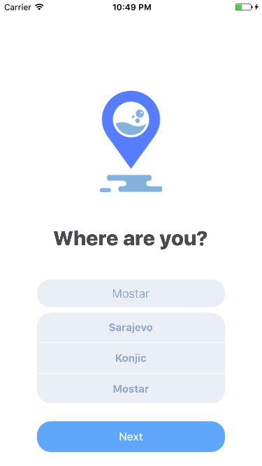

Wash Ves Native iOS App

Progress so far:

1. Splash Screen with animation
2. Get Started screen - choose your city
Screenshot:

Next steps:

1. Main manu with icons to choose
  1.1 Collection view
  1.2 Modal view for click on cell
  1.3 Another view inside modal for item counting
  1.4 Dismiss modal button

2. Location and date screen
  2.1 Date (timeframe) with 3rd party lib: https://github.com/Glow-Inc/GLCalendarView
  2.2 Google places text field
  2.3 (optional) MapView for location pins

3. Basket screen
  3.1 Tableview for basket items

4. Side menu
  4.1 History of all orders (list)
  4.2 Active orders
  4.3 Profile data

5. Server side
  5.1 Backend for orders api
